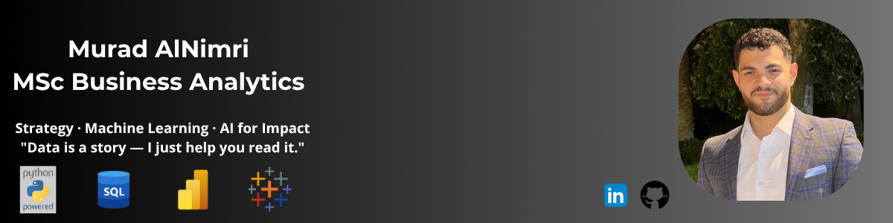

  

# 👋 Hi, I’m Murad Al Nimri

🎓 MSc Business Analytics student at the University of Nottingham | 📊 Data + Strategy Enthusiast | 🧠 Interseted in using AI and data to derive Impactful Insights to help people and businesses succeed.

I combine technical tools like Python, SQL, and Power BI with a strong sense of strategy to deliver meaningful, people-first solutions. I thrive in invironments that blend analytics, communication, and leadership — whether in consulting, digital strategy, or data storytelling.

## 📁 Projects

  <!-- Project 1 -->
  

    
    

      <h3 style="margin-top: 0;">Brand Analysis Using Twitter</h3>
      
Sentiment and social network analysis of Nike & Lululemon Twitter activity. NLP, emotion detection, influencer mapping via LDA and NetworkX.

    

    

      <a href="./projects/lululemonvsnike-report.pdf" target="_blank" style="display: inline-block; text-align: center; font-weight: bold; background: #007acc; color: white; padding: 10px 20px; border-radius: 6px; text-decoration: none; transition: background 0.3s ease;">More</a>
    

  

  <!-- Project 2 -->
  

    
    

      <h3 style="margin-top: 0;">Churn Prediction through Temporal Modelling</h3>
      
XGBoost + Logistic Regression pipeline for churn prediction with SHAP explainability and weekly retraining simulation.

    

    

      <a href="./projects/temporal_churn_prediction-report.pdf" target="_blank" style="display: inline-block; text-align: center; font-weight: bold; background: #007acc; color: white; padding: 10px 20px; border-radius: 6px; text-decoration: none; transition: background 0.3s ease;">More</a>
    

  

  <!-- Project 3 -->
  

    
    

      <h3 style="margin-top: 0;">Customer Subscription Prediction</h3>
      
Random Forest model predicting term deposit subscription, with class imbalance handling and cost-benefit threshold tuning.

    

    

      <a href="./projects/subscription-model.pdf" target="_blank" style="display: inline-block; text-align: center; font-weight: bold; background: #007acc; color: white; padding: 10px 20px; border-radius: 6px; text-decoration: none; transition: background 0.3s ease;">More</a>
    

  

## 📊 Skills & Tools

### 💻 Languages & Tools

  
  
  
  
  
  

### 🧠 NLP & Machine Learning

  
  
  
  
  

🧪 **Techniques:** Predictive Modeling · Sentiment Analysis · Emotion Detection · Topic Modeling · Micro-Influencer Detection

---

### 🧰 Project & Workflow Tools

  
  
  

---

### 💡 Soft Skills

  
  
  
  
  

## 📚 More About Me

### 🎓 Education
- MSc., Business Analytics | The University of Nottingham at Nottingham (_September 2024 - September 2025_)
- BSc., Business Information Technology | Princess Sumaya University For Technology (_September 2020 - February 2024_)

### 💼 Work Experience

<strong>Strategy Consultant, MSc Consultancy Competition - IBM (_May 2025 - June 2025_)</strong> (click to expand)

-	Led a cross-functional team of five in delivering a strategic consulting project for IBM SkillsBuild, applying project management and leadership skills to coordinate research, client meetings, and deliverables.
-	Collaborated with IBM Client Engineering to co-create a strategy aligned with digital credential growth and institutional goals.
-	Conducted stakeholder analysis and user journey mapping to identify adoption gaps, using qualitative insight with policy research to inform high-impact engagement strategies.
-	Proposed a university-student partnership model backed by micro-credential market trends and government education policy, ensuring strategic fit and scalability.
-	Delivered a professional final report, stakeholder-facing presentation, and detailed implementation roadmap, translating research findings into actionable co-branded campaign strategies and ROI-focused KPIs.

<strong>Credit Analyst, Nottingham Advantage Award Product Challenge - Capital One,(_January 2025 - March 2025_)</strong> (click to expand)

- Developed a business launch strategy for a simulated start-up scenario, applying business modelling and planning skills to design an annual operational plan under tight resource and deadline constraints.
-	Participated in Capital One HQ training sessions, strengthening analytical thinking through real-world case studies in financial modelling, data analysis, and strategic decision-making.
-	Conducted market research and SWOT analysis to assess business feasibility, using strategic planning frameworks to craft a profit-oriented growth plan focused on customer acquisition and operational efficiency.
  

<strong>Business Analyst Intern, BlackArrow Logistics (_May 2022 - September 2022_)</strong> (click to expand)

- Developed weekly Power BI dashboards to track logistics KPIs, applying data visualization skills to streamline operational reviews and support faster decision-making.
- Conducted exploratory data analysis on delivery performance using Python and SQL, identifying route inefficiencies that led to a 10% improvement in delivery efficiency.
- Collaborated with cross-functional teams to define business needs and deliver insights using data, improving stakeholder alignment and clarity on performance goals.

## 📬 Let's Connect

- 💼 [LinkedIn](https://www.linkedin.com/in/muradnimri)
- 📫 Email: nimrimurad@gmail.com
- 📄 [View My CV (PDF)](./cv/Murad_Nimri_CV.pdf)  

I'm open to collaboration, internships, freelance consulting, and research in analytics, wellness, tech, and social good.

---

  📘 *"Data is a story — I just help you read it."*  
   
  Thank you for visiting my portfolio!

