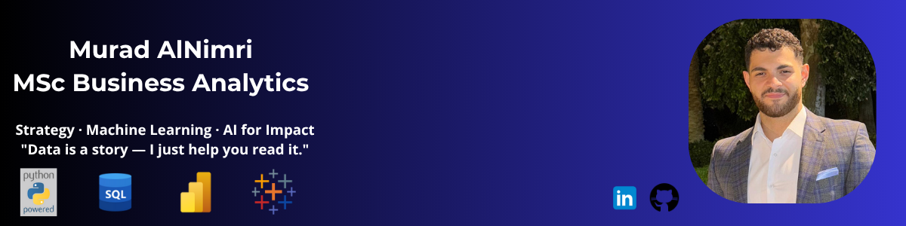

  

# Hi, I’m Murad Al Nimri 👋

🎓 MSc Business Analytics student at the University of Nottingham | 📊 Data + Strategy Enthusiast | 🧠 Intereseted in using AI and data to derive Impactful Insights for people and businesses.

I combine technical tools like Python, SQL with a strong sense of strategy to deliver meaningful, client-first solutions. I thrive in invironments that blend analytics, communication, and leadership — whether in consulting, digital strategy, or data storytelling.

<h2 style="margin-top: 40px;">📁 Projects</h2>

<!-- Project 1 -->

  
  

    <h3 style="margin-top: 0;">Brand Analysis Using Twitter</h3>
    

      Sentiment & influencer analysis of Nike & Lululemon on Twitter using NLP, LDA & NetworkX.
      Project conducted for a company exploring market entry possibilities.
    

    <a href="./projects/lululemonvsnike-report.pdf" target="_blank" style="display: inline-block; background: #007acc; color: white; padding: 10px 20px; text-decoration: none; border-radius: 5px; font-weight: bold;">More</a>
  

<!-- Project 2 -->

  
  

    <h3 style="margin-top: 0;">Churn Prediction through Temporal Modelling</h3>
    

      Development of a machine learning model using XGBoost and Logistic Regression pipeline with SHAP explainability and weekly retraining to predict customer churn based on behavioral patterns in transaction data, enabling proactive retention strategies through temporal trend analysis.
    

    <a href="./projects/temporal_churn_prediction-report.pdf" target="_blank" style="display: inline-block; background: #007acc; color: white; padding: 10px 20px; text-decoration: none; border-radius: 5px; font-weight: bold;">More</a>
  

<!-- Project 3 -->

  
  

    <h3 style="margin-top: 0;">Customer Subscription Prediction</h3>
    

      Random Forest classification to predict subscription behavior for a newly launched financial product (Platinum Card).  
Applied threshold tuning and class imbalance techniques to align with business success metrics.
    

    <a href="./projects/subscription-model.pdf" target="_blank" style="display: inline-block; background: #007acc; color: white; padding: 10px 20px; text-decoration: none; border-radius: 5px; font-weight: bold;">More</a>
  

## Skills & Tools

### Languages & Tools

  
  
  
  
  
  

**Techniques:** Predictive Modeling · Sentiment Analysis · Classification · Topic Modeling · Temporal Modeling · Supervised Learning

---

### Project & Workflow Tools

  
  
  

---

### Soft Skills

  
  
  
  
  

## More About Me 🌱

### 🎓 Education
- MSc., Business Analytics | The University of Nottingham at Nottingham (_September 2024 - September 2025_)
- BSc., Business Information Technology | Princess Sumaya University For Technology (_September 2020 - February 2024_)

---

### 💼 Work Experience

<strong> Strategy Consultation, MSc Consultancy Competition - IBM (_May 2025 - June 2025_)</strong> (click to expand)

-	Led a cross-functional team of five in delivering a strategic consulting project for IBM SkillsBuild, applying project management and leadership skills to coordinate research, client meetings, and deliverables.
-	Collaborated with IBM Client Engineering to co-create a strategy aligned with digital credential growth and institutional goals.
-	Conducted stakeholder analysis and user journey mapping to identify adoption gaps, using qualitative insight with policy research to inform high-impact engagement strategies.
-	Proposed a university-student partnership model backed by micro-credential market trends and government education policy, ensuring strategic fit and scalability.
-	Delivered a professional final report, stakeholder-facing presentation, and detailed implementation roadmap, translating research findings into actionable co-branded campaign strategies and ROI-focused KPIs.

<strong> Credit Analyst Simulation, Nottingham Advantage Award Product Challenge - Capital One,(_January 2025 - March 2025_)</strong> (click to expand)

- Conducted credit analytics in a simulated market environment, continuously adapting our loan strategy—including APR, credit score thresholds, and approval limits—to respond to changing customer behavior and competitor moves.
-	Participated in Capital One HQ training sessions, applying real-world financial modelling, data analysis, credit scoring principles, and strategic decision-making to optimize lending outcomes.
-	Used market research and SWOT analysis to evaluate evolving feasibility, guiding a customer-focused lending plan that balanced profitability with risk mitigation.
  

<strong>Business Analyst Intern, BlackArrow Logistics (_May 2022 - September 2022_)</strong> (click to expand)

- Developed weekly Power BI dashboards to track logistics KPIs, applying data visualization skills to streamline operational reviews and support faster decision-making.
- Conducted exploratory data analysis on delivery performance using Python and SQL, identifying route inefficiencies that led to a 10% improvement in delivery efficiency.
- Collaborated with cross-functional teams to define business needs and deliver insights using data, improving stakeholder alignment and clarity on performance goals.

---

## 🤝 Let’s Connect!

I’m always excited to meet curious minds, share ideas, and explore new opportunities. Whether you're interested in data, tech, wellness, or simply want to chat about cool projects — I’d love to hear from you.

  
  
  
  
  

> 💡 *Open to collaborations, Full-Time Jobs, freelance analytics work, or research in tech, wellness, and social good.*

---

   *"Whether it's reducing losses or increasing profits, I use data to make business smarter & make an impact."*  
   
  Thank you for visiting my portfolio!

  <a href="#">🔝 Back to Top</a>

